<div align="center">

# 🧪 LAB 10 — Frida Installation & Android Instrumentation

### Sécurité des Applications Mobiles


</div>

---

## 📌 Présentation du lab

Ce laboratoire consiste à installer et configurer **Frida** afin de réaliser une analyse dynamique Android dans un environnement contrôlé.

L’objectif est de mettre en place un workflow complet permettant de :

- installer le client Frida côté Windows ;
- vérifier Python, pip, Frida CLI et ADB ;
- identifier l’architecture CPU de l’émulateur Android ;
- télécharger et déployer la version compatible de `frida-server` ;
- vérifier la communication entre le PC et l’émulateur ;
- injecter un script JavaScript minimal ;
- hooker des fonctions natives réseau et fichiers ;
- explorer la console interactive Frida ;
- observer des bibliothèques crypto/TLS et des classes Java sensibles ;
- hooker des composants Java liés au stockage local et au runtime ;
- simuler une erreur Frida/ADB et documenter sa correction.

---

## 🧠 Résumé technique

| Élément | Résultat |
|---|---|
| Système hôte | Windows |
| Terminal utilisé | PowerShell |
| Appareil cible | Android Emulator |
| Device ID | `emulator-5554` |
| Architecture Android | `x86_64` |
| Version Frida | `17.9.11` |
| Frida Server | `frida-server-17.9.11-android-x86_64` |
| Application cible | `com.android.chrome` |
| Injection Java | ✅ Réussie |
| Hook natif `recv` | ✅ Réussi |
| Console interactive | ✅ Explorée |
| Hooks natifs avancés | ✅ Réalisés |
| Hooks Java avancés | ✅ Réalisés |
| Dépannage | ✅ Simulé et corrigé |

> L’application `ma.ens.app1` mentionnée dans l’énoncé n’était pas installée sur l’émulateur.  
> Les tests ont donc été réalisés sur **Google Chrome**, via le package Android `com.android.chrome`.

---

## 📁 Structure finale du projet

```text
LAB10_Frida
│   .gitignore
│   README.md
│
├───screenshots
│       adb_forwarding.png
│       adb_root_shell-id.png
│       adb_version_devices.png
│       console_crypto_classes.png
│       console_modules_1.png
│       console_modules_2.png
│       console_modules_3.png
│       console_process_info.png
│       correction_depannage.png
│       cpu_architecture.png
│       erreur_frida.png
│       frida-ps_U.png
│       frida-ps_Uai.png
│       frida-server_extracted.png
│       frida-server_run.png
│       frida-server_run_verification.png
│       frida_install.png
│       frida_server_push_chmod.png
│       frida_versions.png
│       hello-js_injection.png
│       hello_native-js_injection.png
│       hook-connect-executed.png
│       hook-connect_nospam.png
│       hook-connect_script.png
│       hook-debug_executed.png
│       hook-debug_script.png
│       hook-file-java_executed.png
│       hook-file-java_script.png
│       hook-file_executed.png
│       hook-file_script.png
│       hook-network_executed.png
│       hook-network_script.png
│       hook-prefs-write_executed.png
│       hook-prefs-write_script.png
│       hook-prefs_executed.png
│       hook-prefs_script.png
│       hook-runtime_executed.png
│       hook-runtime_script.png
│       hook-sqlite_executed.png
│       hook-sqlite_script.png
│       python_pip_version.png
│
└───scripts
        hello.js
        hello_native.js
        hook_connect.js
        hook_debug.js
        hook_file.js
        hook_file_java.js
        hook_network.js
        hook_prefs.js
        hook_prefs_write.js
        hook_runtime.js
        hook_sqlite.js
```

---

# 1. Préparation de l’environnement

## 1.1 Vérification de Python et pip

Avant d’installer Frida, j’ai vérifié que Python et pip étaient disponibles sur Windows.

```powershell
python --version
pip --version
```

<p align="center">
  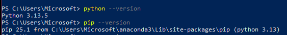
</p>

---

## 1.2 Installation du client Frida

Le client Frida correspond aux outils utilisés côté ordinateur : la bibliothèque Python `frida` et les outils CLI `frida-tools`.

```powershell
python -m pip install --upgrade frida frida-tools
```

<p align="center">
  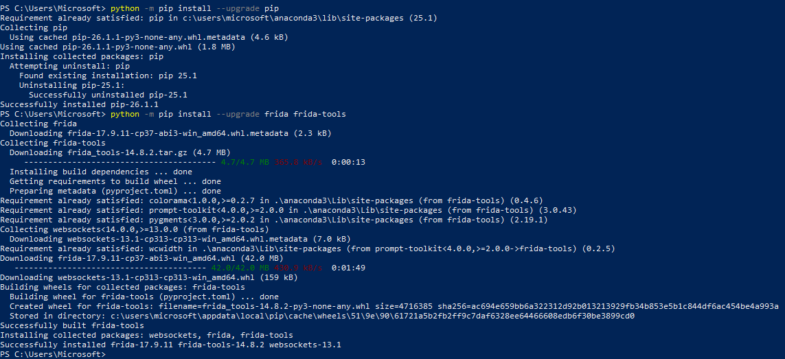
</p>

---

## 1.3 Vérification des versions Frida

Après l’installation, les versions du client Frida, de `frida-ps` et de la bibliothèque Python ont été vérifiées.

```powershell
frida --version
frida-ps --version
python -c "import frida; print(frida.__version__)"
```

Résultat obtenu :

```text
17.9.11
```

<p align="center">
  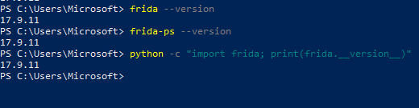
</p>

---

# 2. Configuration Android avec ADB

## 2.1 Vérification d’ADB et de l’émulateur

ADB permet de communiquer avec l’émulateur Android.

```powershell
adb version
adb devices
```

L’émulateur a bien été détecté :

```text
emulator-5554   device
```

<p align="center">
  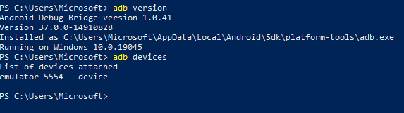
</p>

---

## 2.2 Accès root sur l’émulateur

L’accès root a été activé afin de pouvoir lancer `frida-server`.

```powershell
adb root
adb shell id
```

<p align="center">
  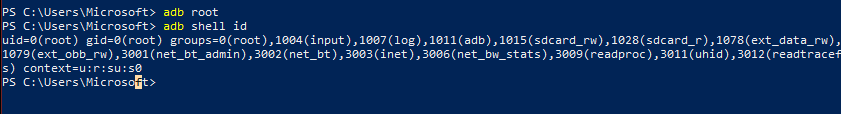
</p>

---

## 2.3 Identification de l’architecture CPU

Avant de télécharger `frida-server`, l’architecture CPU de l’émulateur a été identifiée.

```powershell
adb shell getprop ro.product.cpu.abi
```

Résultat obtenu :

```text
x86_64
```

La version compatible est donc :

```text
frida-server-17.9.11-android-x86_64.xz
```

<p align="center">
  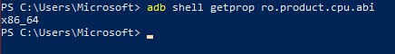
</p>

---

# 3. Déploiement de `frida-server`

## 3.1 Extraction du binaire

Le fichier téléchargé a été extrait afin d’obtenir le binaire `frida-server`.

```text
frida-server-17.9.11-android-x86_64.xz
```

<p align="center">
  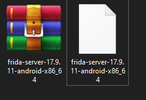
</p>

---

## 3.2 Copie vers Android et permissions

Le binaire a été transféré vers `/data/local/tmp`, puis rendu exécutable.

```powershell
adb push .\frida-server /data/local/tmp/frida-server
adb shell chmod 755 /data/local/tmp/frida-server
adb shell ls -l /data/local/tmp/frida-server
```

Les permissions obtenues confirment que le fichier est exécutable :

```text
-rwxr-xr-x
```

<p align="center">
  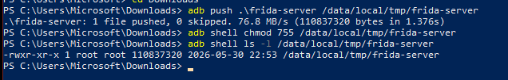
</p>

---

## 3.3 Lancement de `frida-server`

Le serveur Frida a été lancé sur l’émulateur Android.

```powershell
adb shell "/data/local/tmp/frida-server -l 0.0.0.0"
```

Une autre méthode utilisée permet de le lancer en arrière-plan :

```powershell
adb shell "nohup /data/local/tmp/frida-server -l 0.0.0.0 >/dev/null 2>&1 &"
```

<p align="center">
  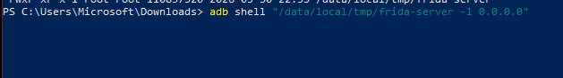
</p>

---

## 3.4 Vérification de `frida-server`

Une première vérification a été réalisée avec :

```powershell
frida-ps -U
```

<p align="center">
  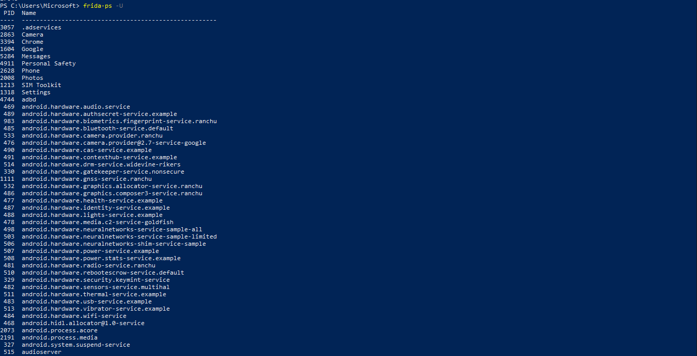
</p>

Une vérification supplémentaire a également été réalisée pour confirmer que `frida-server` était bien opérationnel.

<p align="center">
  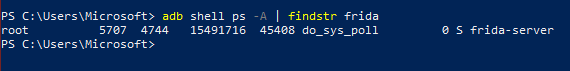
</p>

---

## 3.5 Redirection des ports ADB

Les ports utilisés par Frida ont été redirigés avec ADB.

```powershell
adb forward tcp:27042 tcp:27042
adb forward tcp:27043 tcp:27043
```

<p align="center">
  
</p>

---

# 4. Test de connexion avec `frida-ps`

La commande suivante permet de lister les applications installées sur l’émulateur.

```powershell
frida-ps -Uai
```

<p align="center">
  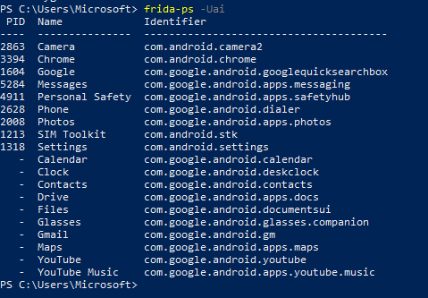
</p>

Cette étape valide que :

- le client Frida fonctionne ;
- `frida-server` est actif ;
- ADB communique avec l’émulateur ;
- Frida peut lister les applications Android.

---

# 5. Injection Java minimale

## 5.1 Script `hello.js`

Le premier script permet de vérifier que Frida peut exécuter du JavaScript dans le runtime Java Android.

```javascript
Java.perform(function () {
  console.log("[+] Frida Java.perform OK");
});
```

Fichier :

```text
scripts/hello.js
```

---

## 5.2 Exécution du script

```powershell
frida -U -f com.android.chrome -l .\scripts\hello.js
```

Résultat attendu :

```text
[+] Frida Java.perform OK
```

<p align="center">
  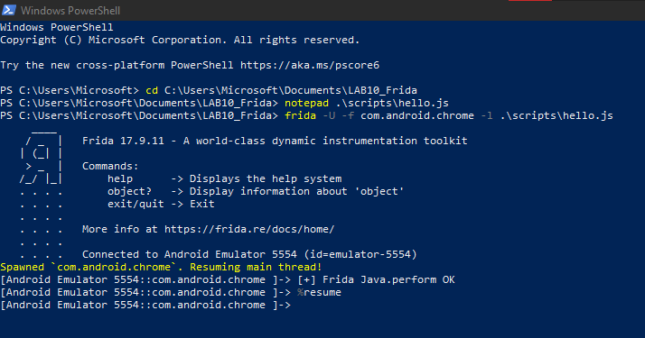
</p>

Cette injection confirme que l’API Java de Frida est fonctionnelle dans le processus cible.

---

# 6. Injection native avec hook sur `recv`

## 6.1 Script `hello_native.js`

Le script suivant intercepte la fonction native `recv`.

```javascript
console.log("[+] Script chargé");

function getExport(name) {
  if (Module.getGlobalExportByName) {
    return Module.getGlobalExportByName(name);
  }
  return Module.getExportByName(null, name);
}

const recvPtr = getExport("recv");
console.log("[+] recv trouvée à : " + recvPtr);

Interceptor.attach(recvPtr, {
  onEnter(args) {
    console.log("[+] recv appelée");
  }
});
```

Fichier :

```text
scripts/hello_native.js
```

---

## 6.2 Exécution du hook natif

```powershell
frida -U -f com.android.chrome -l .\scripts\hello_native.js
```

<p align="center">
  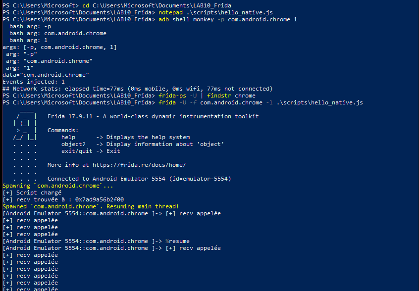
</p>

Cette étape confirme que Frida peut intercepter une fonction native dans un processus Android.

---

# 7. Exploration de la console interactive Frida

Après l’attachement à un processus, Frida ouvre une console interactive permettant d’exécuter des commandes JavaScript directement dans le processus cible.

## 7.1 Commandes d’inspection utilisées

```javascript
Process.arch
Process.platform
Process.id
Process.mainModule
Java.available
Process.getModuleByName("libc.so")
Process.getModuleByName("libc.so").getExportByName("recv")
Process.enumerateModules().slice(0, 10).map(m => m.name)
Process.enumerateThreads().slice(0, 5)
Process.enumerateRanges('r-x').slice(0, 5)
```

Ces commandes permettent d’observer :

- l’architecture du processus ;
- la plateforme ;
- l’identifiant du processus ;
- le module principal ;
- la disponibilité du runtime Java ;
- la présence de `libc.so` ;
- l’adresse de la fonction native `recv` ;
- les modules chargés ;
- les threads actifs ;
- les zones mémoire exécutables.

---

## 7.2 Informations du processus

<p align="center">
  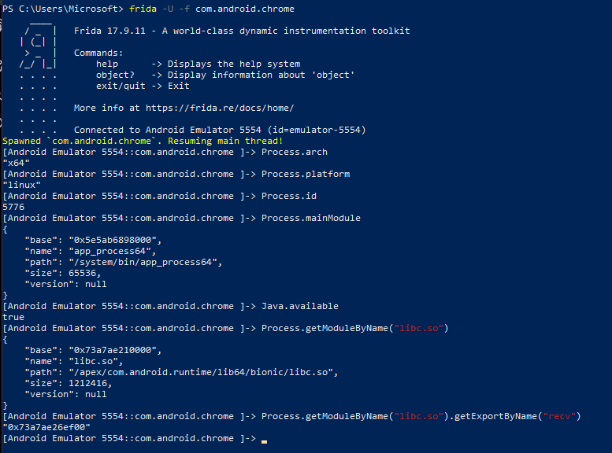
</p>

---

## 7.3 Modules, threads et zones mémoire

<table>
<tr>
<td align="center">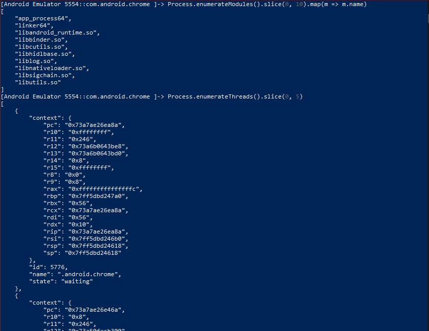</td>
<td align="center">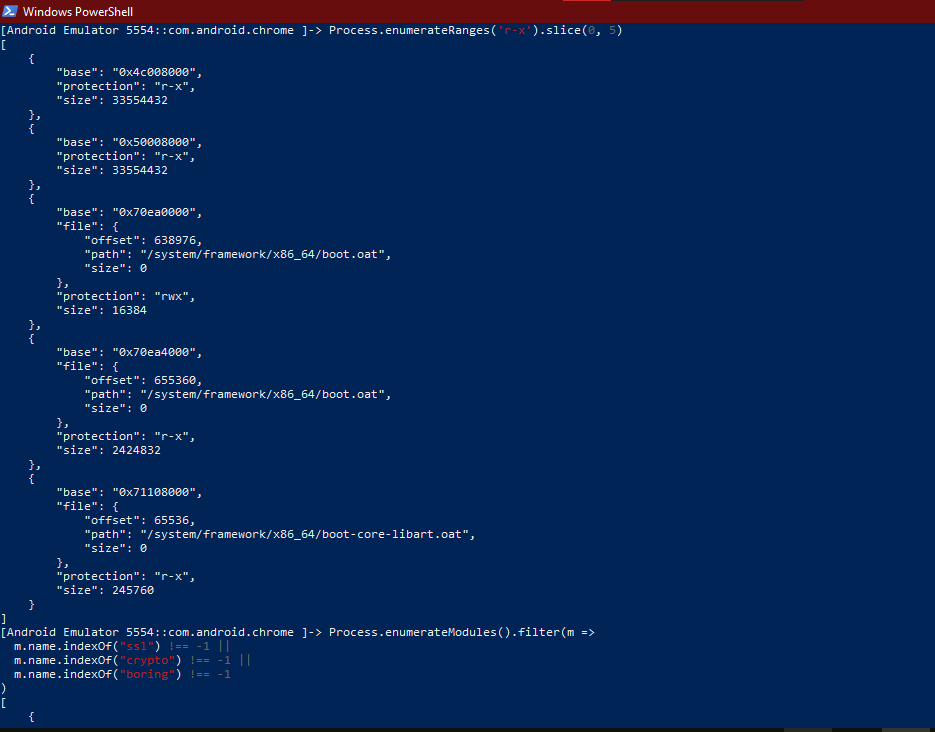</td>
</tr>
<tr>
<td colspan="2" align="center">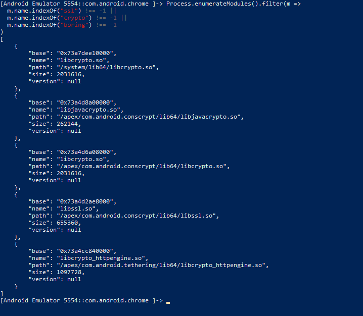</td>
</tr>
</table>

---

## 7.4 Recherche de bibliothèques crypto/TLS et classes Java sensibles

J’ai filtré les bibliothèques dont le nom contient `ssl`, `crypto` ou `boring`.

```javascript
Process.enumerateModules().filter(m =>
  m.name.toLowerCase().indexOf("ssl") !== -1 ||
  m.name.toLowerCase().indexOf("crypto") !== -1 ||
  m.name.toLowerCase().indexOf("boring") !== -1
).map(m => m.name)
```

J’ai également énuméré certaines classes Java chargées dont le nom peut être lié à la sécurité, au debug, au stockage ou au chiffrement.

```javascript
Java.perform(function () {
  Java.enumerateLoadedClasses({
    onMatch: function (name) {
      var n = name.toLowerCase();
      if (
        n.indexOf("debug") !== -1 ||
        n.indexOf("root") !== -1 ||
        n.indexOf("security") !== -1 ||
        n.indexOf("crypto") !== -1 ||
        n.indexOf("sqlite") !== -1 ||
        n.indexOf("prefs") !== -1
      ) {
        console.log(name);
      }
    },
    onComplete: function () {
      console.log("Fin de l'énumération");
    }
  });
});
```

<p align="center">
  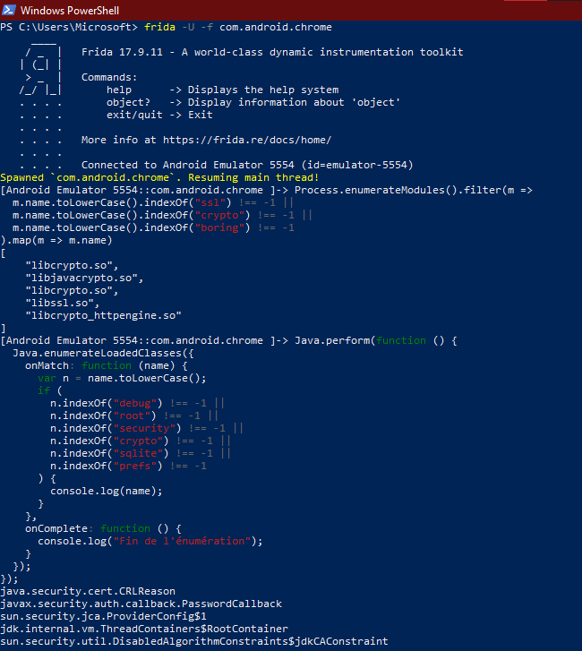
</p>

Cette étape permet de repérer rapidement les composants liés au chiffrement, au stockage local, au debug et aux mécanismes de sécurité.

---

# 8. Hooks natifs avancés

## 8.1 Hook de `connect`

Le hook `connect` permet d’observer les tentatives de connexion réseau effectuées par l’application.

Fichier :

```text
scripts/hook_connect.js
```

Commande :

```powershell
frida -U -f com.android.chrome -l .\scripts\hook_connect.js
```

<table>
<tr>
<td align="center">
<b>Script</b><br>
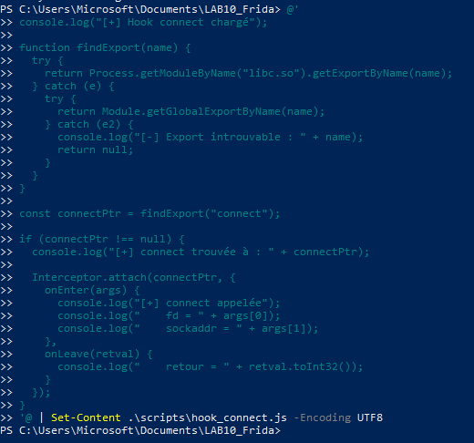
</td>
<td align="center">
<b>Exécution limitée anti-spam</b><br>
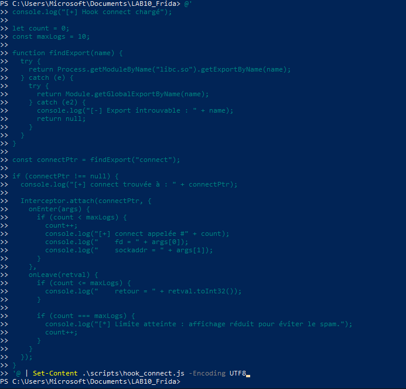
</td>
</tr>
</table>

Une première exécution complète du hook `connect` a aussi été capturée avant la version limitée.

<p align="center">
  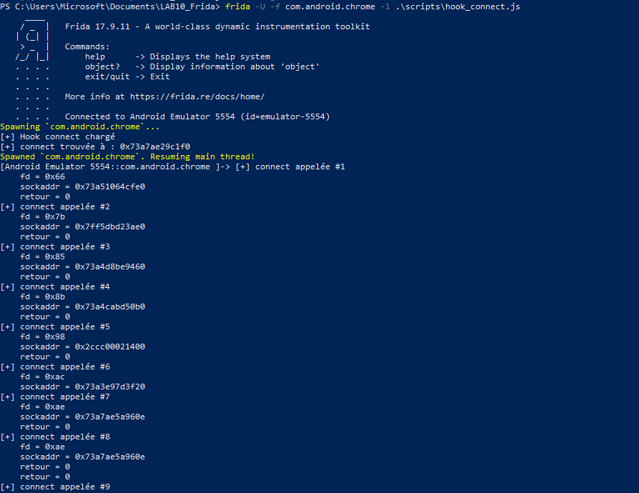
</p>

Résultat observé :

```text
[+] Hook connect chargé
[+] connect trouvée à : 0x...
[+] connect appelée #1
fd = ...
sockaddr = ...
retour = 0
```

Ce hook confirme que l’application initie des connexions réseau pendant son exécution.

---

## 8.2 Hook réseau `send` / `recv`

Le hook réseau permet d’observer l’envoi et la réception de données.

Fichier :

```text
scripts/hook_network.js
```

Commande :

```powershell
frida -U -f com.android.chrome -l .\scripts\hook_network.js
```

<table>
<tr>
<td align="center">
<b>Script</b><br>
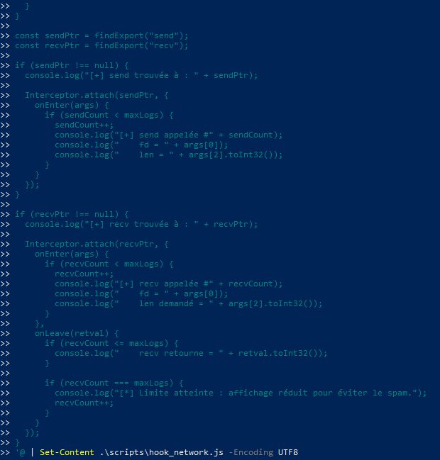
</td>
<td align="center">
<b>Exécution</b><br>
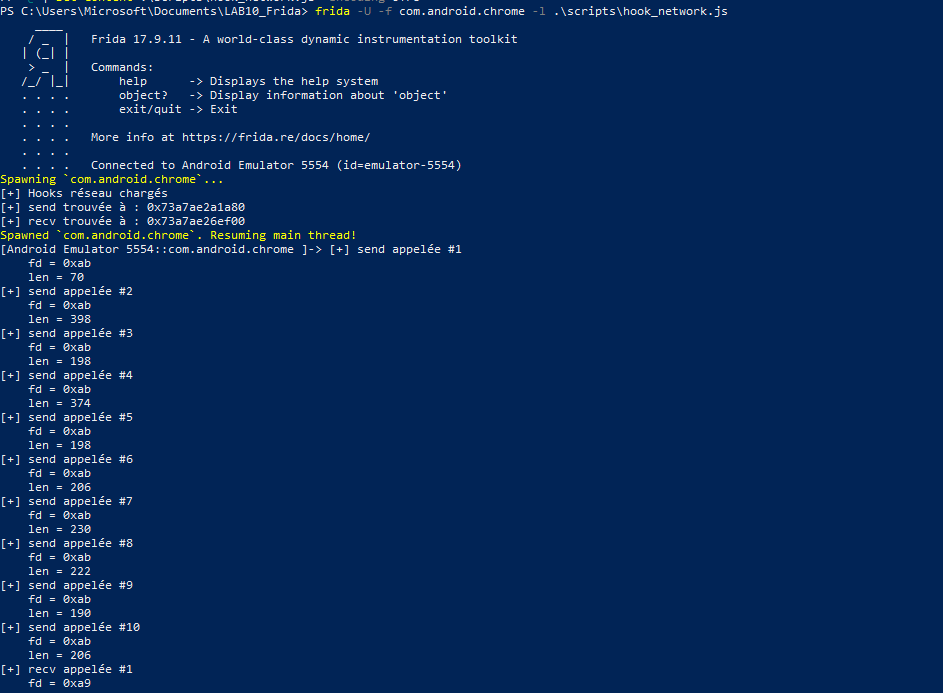
</td>
</tr>
</table>

Résultat observé :

```text
[+] Hooks réseau chargés
[+] send trouvée à : 0x...
[+] recv trouvée à : 0x...
[+] send appelée #1
[+] recv appelée #1
```

Cette étape montre que Frida peut observer des appels réseau natifs liés à l’envoi et à la réception de données.

---

## 8.3 Hook fichiers `open`, `openat` et `read`

Ce hook permet d’observer les accès natifs aux fichiers.

Fichier :

```text
scripts/hook_file.js
```

Commande :

```powershell
frida -U -f com.android.chrome -l .\scripts\hook_file.js
```

<table>
<tr>
<td align="center">
<b>Script</b><br>
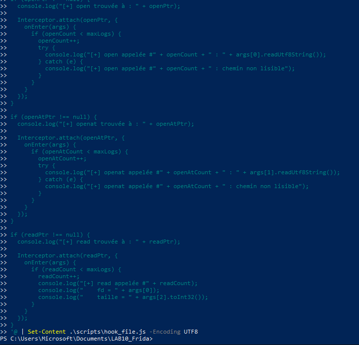
</td>
<td align="center">
<b>Exécution</b><br>
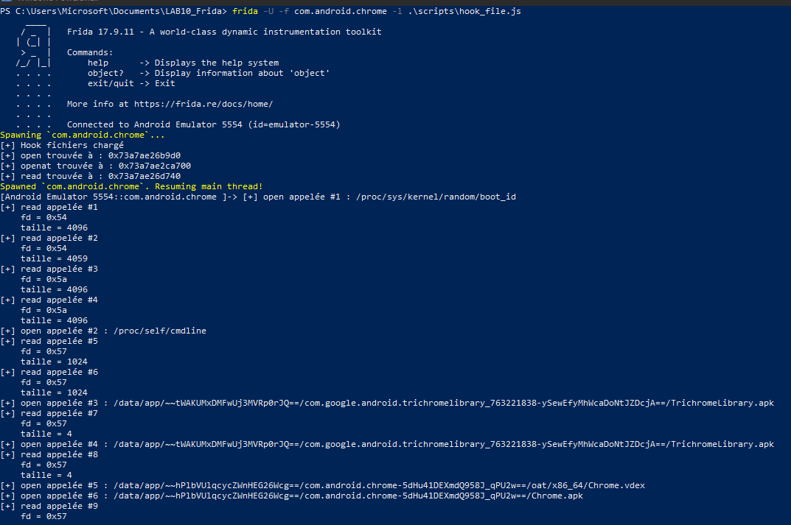
</td>
</tr>
</table>

Exemples observés :

```text
/proc/sys/kernel/random/boot_id
/proc/self/cmdline
/data/app/...
/data/user/0/com.android.chrome/...
```

Ce résultat montre que l’application accède à plusieurs fichiers système et fichiers internes pendant son exécution.

---

# 9. Hooks Java avancés

## 9.1 Hook SharedPreferences — lectures

Ce hook observe les lectures de préférences locales via `getString` et `getBoolean`.

Fichier :

```text
scripts/hook_prefs.js
```

Commande :

```powershell
frida -U -f com.android.chrome -l .\scripts\hook_prefs.js
```

<table>
<tr>
<td align="center">
<b>Script</b><br>
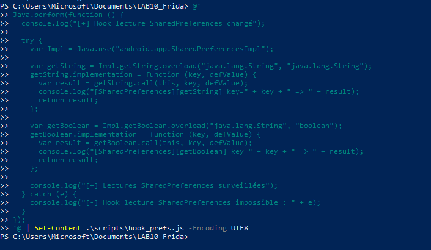
</td>
<td align="center">
<b>Exécution</b><br>
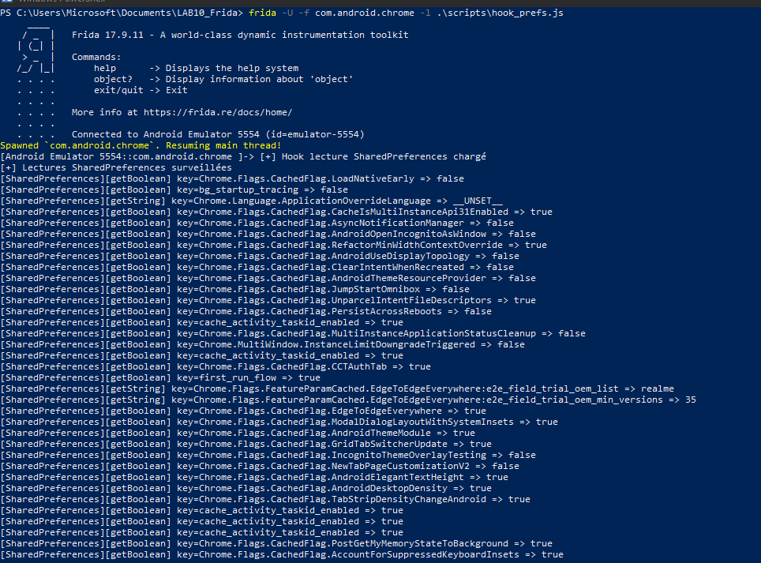
</td>
</tr>
</table>

Résultat observé :

```text
[SharedPreferences][getBoolean] ...
[SharedPreferences][getString] ...
```

Ces logs montrent que Chrome lit plusieurs clés de configuration internes.

---

## 9.2 Hook SharedPreferences — écritures

Ce hook observe les écritures dans les préférences locales via `putString` et `putBoolean`.

Fichier :

```text
scripts/hook_prefs_write.js
```

Commande :

```powershell
frida -U -f com.android.chrome -l .\scripts\hook_prefs_write.js
```

<table>
<tr>
<td align="center">
<b>Script</b><br>
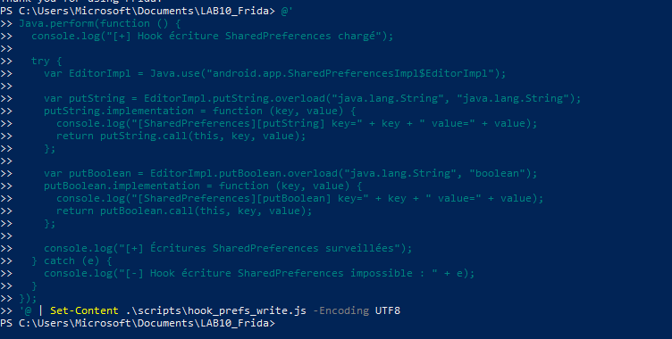
</td>
<td align="center">
<b>Exécution</b><br>
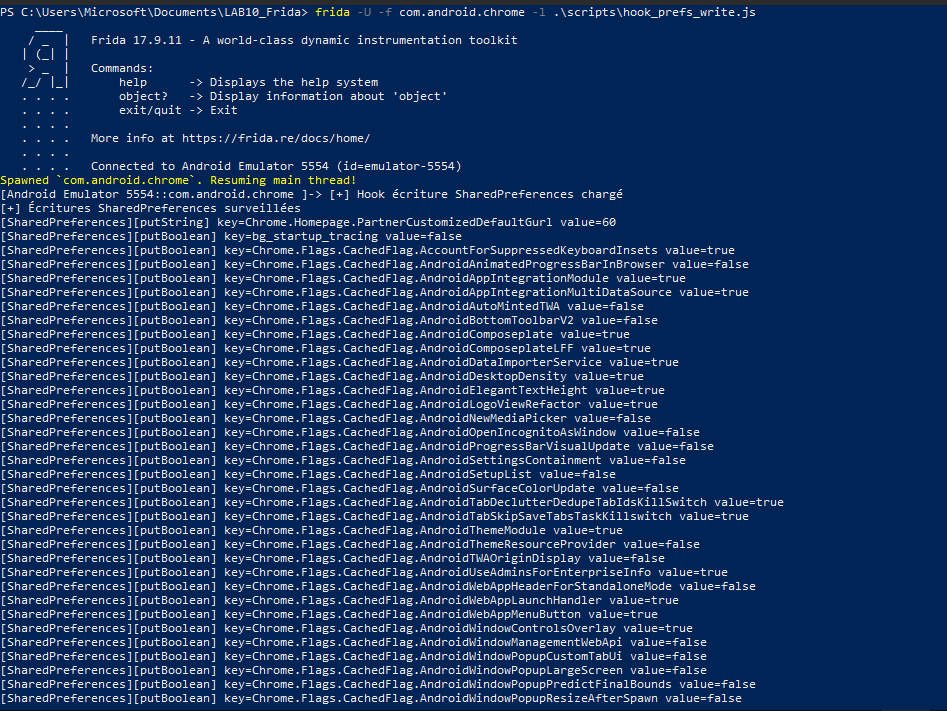
</td>
</tr>
</table>

Résultat observé :

```text
[SharedPreferences][putBoolean] ...
[SharedPreferences][putString] ...
```

Cette étape confirme que Frida peut observer certaines écritures dans le stockage local Java.

---

## 9.3 Hook SQLite

Ce hook surveille certaines méthodes SQLite comme `execSQL` et `rawQuery`.

Fichier :

```text
scripts/hook_sqlite.js
```

Commande :

```powershell
frida -U -f com.android.chrome -l .\scripts\hook_sqlite.js
```

<table>
<tr>
<td align="center">
<b>Script</b><br>
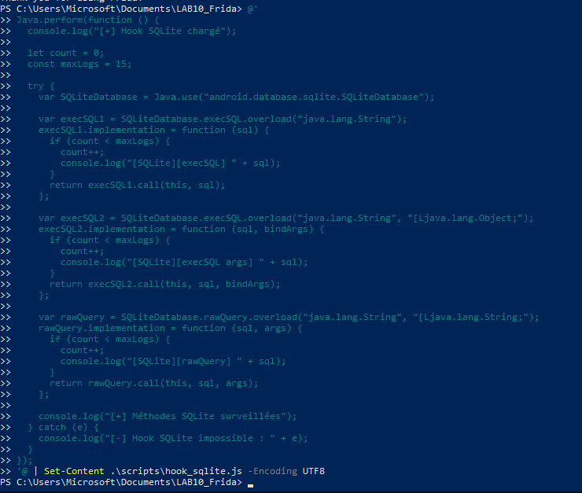
</td>
<td align="center">
<b>Exécution</b><br>
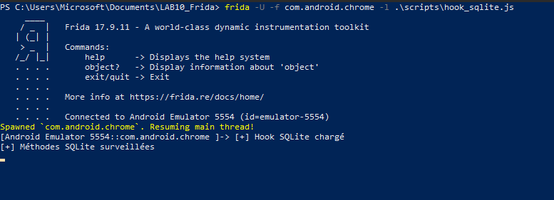
</td>
</tr>
</table>

Même si aucune requête SQL visible n’a été déclenchée pendant le court test, le hook a été chargé correctement :

```text
[+] Hook SQLite chargé
[+] Méthodes SQLite surveillées
```

---

## 9.4 Hook Debug

Ce hook observe certaines méthodes liées au débogage Android.

Fichier :

```text
scripts/hook_debug.js
```

Commande :

```powershell
frida -U -f com.android.chrome -l .\scripts\hook_debug.js
```

<table>
<tr>
<td align="center">
<b>Script</b><br>
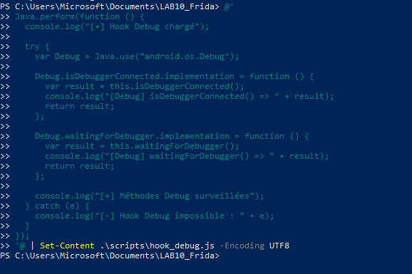
</td>
<td align="center">
<b>Exécution</b><br>
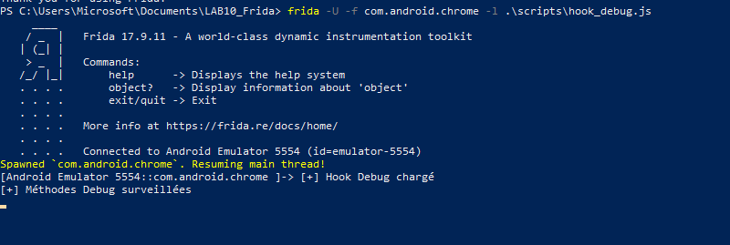
</td>
</tr>
</table>

Méthodes surveillées :

```text
android.os.Debug.isDebuggerConnected()
android.os.Debug.waitingForDebugger()
```

Le hook a été chargé correctement, même si Chrome n’a pas déclenché ces méthodes pendant le court test.

---

## 9.5 Hook Runtime.exec

Ce hook observe les appels à `Runtime.exec`, utilisés lorsqu’une application lance une commande système.

Fichier :

```text
scripts/hook_runtime.js
```

Commande :

```powershell
frida -U -f com.android.chrome -l .\scripts\hook_runtime.js
```

<table>
<tr>
<td align="center">
<b>Script</b><br>
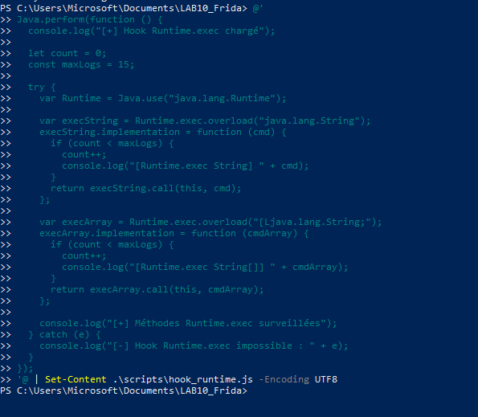
</td>
<td align="center">
<b>Exécution</b><br>
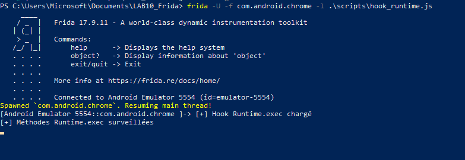
</td>
</tr>
</table>

Le hook a été chargé correctement :

```text
[+] Hook Runtime.exec chargé
[+] Méthodes Runtime.exec surveillées
```

Chrome n’a pas déclenché `Runtime.exec()` pendant le court test, mais le hook est bien installé.

---

## 9.6 Hook Java `java.io.File`

Ce hook observe les chemins de fichiers créés côté Java.

Fichier :

```text
scripts/hook_file_java.js
```

Commande :

```powershell
frida -U -f com.android.chrome -l .\scripts\hook_file_java.js
```

<table>
<tr>
<td align="center">
<b>Script</b><br>
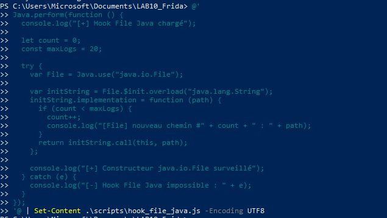
</td>
<td align="center">
<b>Exécution</b><br>
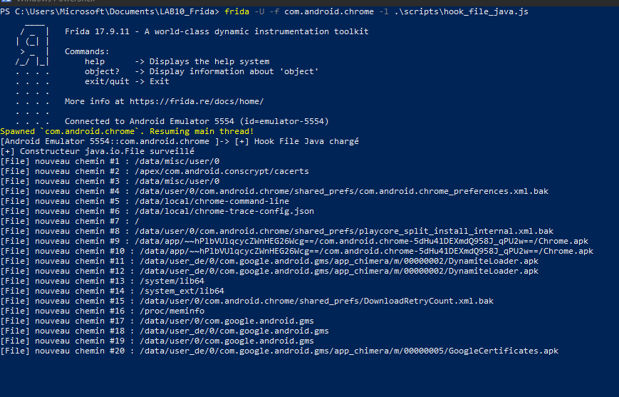
</td>
</tr>
</table>

Exemples observés :

```text
/data/misc/user/0
/apex/com.android.conscrypt/cacerts
/data/user/0/com.android.chrome/shared_prefs/...
/data/app/...
/system_ext/lib64
```

Ce résultat montre que l’application manipule plusieurs chemins liés à son stockage local, ses préférences et ses ressources.

---

# 10. Dépannage Frida / ADB

## 10.1 Simulation de l’erreur

Pour simuler une panne de communication, le serveur ADB a été arrêté.

```powershell
adb disconnect
adb kill-server
frida-ps -U
```

Résultat observé :

```text
Waiting for USB device to appear...
```

<p align="center">
  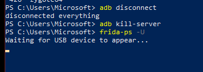
</p>

---

## 10.2 Diagnostic

Le problème venait de l’interruption de la communication entre Frida et l’émulateur via ADB.

Commande de diagnostic :

```powershell
adb devices
```

---

## 10.3 Correction

La correction a consisté à redémarrer ADB, vérifier l’émulateur, restaurer `frida-server`, relancer le serveur et rétablir les redirections de ports.

```powershell
adb start-server
adb devices
adb root
adb wait-for-device
adb shell mv /data/local/tmp/frida-server_OFF /data/local/tmp/frida-server
adb shell chmod 755 /data/local/tmp/frida-server
adb shell "nohup /data/local/tmp/frida-server -l 0.0.0.0 >/dev/null 2>&1 &"
adb forward tcp:27042 tcp:27042
adb forward tcp:27043 tcp:27043
frida-ps -Uai
```

<p align="center">
  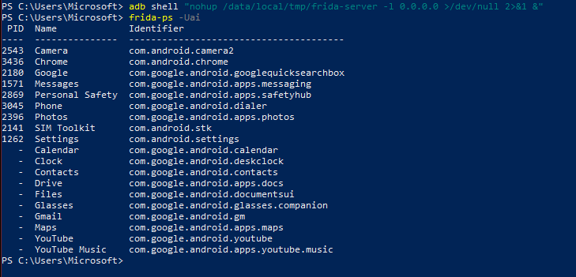
</p>

La liste des applications est réapparue, ce qui confirme que la connexion Frida a été restaurée.

---

# 11. Bilan des livrables

| Livrable | État | Preuve |
|---|---:|---|
| Vérification Python / pip | ✅ | `python_pip_version.png` |
| Installation Frida | ✅ | `frida_install.png` |
| Versions Frida | ✅ | `frida_versions.png` |
| Vérification ADB | ✅ | `adb_version_devices.png` |
| Accès root | ✅ | `adb_root_shell-id.png` |
| Architecture CPU | ✅ | `cpu_architecture.png` |
| Extraction `frida-server` | ✅ | `frida-server_extracted.png` |
| Déploiement `frida-server` | ✅ | `frida_server_push_chmod.png` |
| Lancement `frida-server` | ✅ | `frida-server_run.png` |
| Vérification `frida-server` | ✅ | `frida-server_run_verification.png` |
| `frida-ps -U` | ✅ | `frida-ps_U.png` |
| `frida-ps -Uai` | ✅ | `frida-ps_Uai.png` |
| Redirection ports ADB | ✅ | `adb_forwarding.png` |
| Injection Java `hello.js` | ✅ | `hello-js_injection.png` |
| Hook natif `recv` | ✅ | `hello_native-js_injection.png` |
| Console interactive — process info | ✅ | `console_process_info.png` |
| Console interactive — modules | ✅ | `console_modules_1.png`, `console_modules_2.png`, `console_modules_3.png` |
| Crypto/TLS + classes Java sensibles | ✅ | `console_crypto_classes.png` |
| Hook `connect` complet | ✅ | `hook-connect-executed.png` |
| Hook `connect` anti-spam | ✅ | `hook-connect_nospam.png` |
| Script `connect` | ✅ | `hook-connect_script.png` |
| Hook `send` / `recv` | ✅ | `hook-network_executed.png` |
| Script réseau | ✅ | `hook-network_script.png` |
| Hook fichiers natifs | ✅ | `hook-file_executed.png` |
| Script fichiers natifs | ✅ | `hook-file_script.png` |
| Hook SharedPreferences read | ✅ | `hook-prefs_executed.png` |
| Script SharedPreferences read | ✅ | `hook-prefs_script.png` |
| Hook SharedPreferences write | ✅ | `hook-prefs-write_executed.png` |
| Script SharedPreferences write | ✅ | `hook-prefs-write_script.png` |
| Hook SQLite | ✅ | `hook-sqlite_executed.png` |
| Script SQLite | ✅ | `hook-sqlite_script.png` |
| Hook Debug | ✅ | `hook-debug_executed.png` |
| Script Debug | ✅ | `hook-debug_script.png` |
| Hook Runtime.exec | ✅ | `hook-runtime_executed.png` |
| Script Runtime.exec | ✅ | `hook-runtime_script.png` |
| Hook Java File | ✅ | `hook-file-java_executed.png` |
| Script Java File | ✅ | `hook-file-java_script.png` |
| Erreur simulée | ✅ | `erreur_frida.png` |
| Correction documentée | ✅ | `correction_depannage.png` |

---

# 12. Commandes principales utilisées

```powershell
python --version
pip --version

python -m pip install --upgrade frida frida-tools

frida --version
frida-ps --version
python -c "import frida; print(frida.__version__)"

adb version
adb devices
adb root
adb shell id

adb shell getprop ro.product.cpu.abi

adb push .\frida-server /data/local/tmp/frida-server
adb shell chmod 755 /data/local/tmp/frida-server
adb shell ls -l /data/local/tmp/frida-server

adb shell "nohup /data/local/tmp/frida-server -l 0.0.0.0 >/dev/null 2>&1 &"

adb forward tcp:27042 tcp:27042
adb forward tcp:27043 tcp:27043

frida-ps -U
frida-ps -Uai

frida -U -f com.android.chrome -l .\scripts\hello.js
frida -U -f com.android.chrome -l .\scripts\hello_native.js

frida -U -f com.android.chrome
frida -U -f com.android.chrome -l .\scripts\hook_connect.js
frida -U -f com.android.chrome -l .\scripts\hook_network.js
frida -U -f com.android.chrome -l .\scripts\hook_file.js
frida -U -f com.android.chrome -l .\scripts\hook_prefs.js
frida -U -f com.android.chrome -l .\scripts\hook_prefs_write.js
frida -U -f com.android.chrome -l .\scripts\hook_sqlite.js
frida -U -f com.android.chrome -l .\scripts\hook_debug.js
frida -U -f com.android.chrome -l .\scripts\hook_runtime.js
frida -U -f com.android.chrome -l .\scripts\hook_file_java.js

adb disconnect
adb kill-server
adb start-server
```

---

# 13. Commandes interactives Frida utilisées

```javascript
Process.arch
Process.platform
Process.id
Process.mainModule
Java.available
Process.getModuleByName("libc.so")
Process.getModuleByName("libc.so").getExportByName("recv")
Process.enumerateModules().slice(0, 10).map(m => m.name)
Process.enumerateThreads().slice(0, 5)
Process.enumerateRanges('r-x').slice(0, 5)
```

```javascript
Process.enumerateModules().filter(m =>
  m.name.toLowerCase().indexOf("ssl") !== -1 ||
  m.name.toLowerCase().indexOf("crypto") !== -1 ||
  m.name.toLowerCase().indexOf("boring") !== -1
).map(m => m.name)
```

```javascript
Java.perform(function () {
  Java.enumerateLoadedClasses({
    onMatch: function (name) {
      var n = name.toLowerCase();
      if (
        n.indexOf("debug") !== -1 ||
        n.indexOf("root") !== -1 ||
        n.indexOf("security") !== -1 ||
        n.indexOf("crypto") !== -1 ||
        n.indexOf("sqlite") !== -1 ||
        n.indexOf("prefs") !== -1
      ) {
        console.log(name);
      }
    },
    onComplete: function () {
      console.log("Fin de l'énumération");
    }
  });
});
```

---

# 14. Nettoyage optionnel

Arrêter `frida-server` :

```powershell
adb shell pkill -f frida-server
```

Supprimer le binaire côté Android :

```powershell
adb shell rm /data/local/tmp/frida-server
```

Désinstaller Frida côté PC :

```powershell
pip uninstall frida frida-tools
```

---

# 15. Bonnes pratiques de sécurité

Frida est un outil puissant d’instrumentation dynamique.  
Son utilisation doit rester limitée à un cadre autorisé.

Bonnes pratiques :

- travailler uniquement sur ses propres applications ou sur un lab autorisé ;
- conserver les versions du client Frida et de `frida-server` alignées ;
- documenter toutes les commandes exécutées ;
- garder les captures comme preuves ;
- éviter l’analyse d’applications tierces sans autorisation ;
- utiliser un émulateur ou un environnement de test isolé.

---

# 16. Conclusion

Ce laboratoire m’a permis de mettre en place un environnement Frida complet pour l’analyse dynamique Android.

Les étapes réalisées couvrent :

- l’installation du client Frida ;
- la configuration d’ADB ;
- l’identification de l’architecture Android ;
- le déploiement et le lancement de `frida-server` ;
- la validation de la connexion avec `frida-ps` ;
- l’injection d’un script Java ;
- l’injection d’un hook natif ;
- l’exploration de la console interactive Frida ;
- l’observation de bibliothèques crypto/TLS ;
- l’énumération de classes Java sensibles ;
- l’observation de fonctions réseau natives ;
- l’observation d’accès fichiers natifs ;
- l’observation de composants Java liés au stockage local ;
- l’observation de composants Java liés au runtime ;
- la simulation et la correction d’une erreur ADB/Frida.

Ce lab constitue une base solide pour comprendre comment Frida peut être utilisé dans une démarche d’analyse dynamique mobile, en observant à la fois le niveau Java et le niveau natif d’une application Android.

---

<div align="center">

## ✅ LAB 10 terminé avec succès

**Frida Client + ADB + Frida Server + Console Interactive + Injection Java + Hooks Natifs + Hooks Java + Dépannage**

</div>
